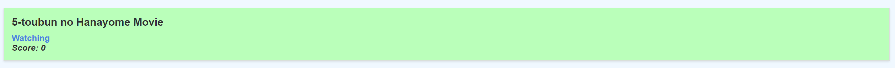
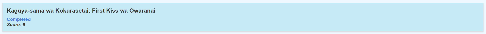
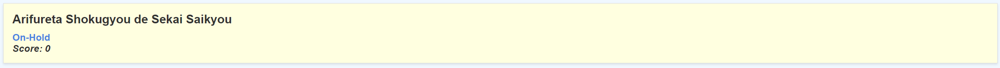
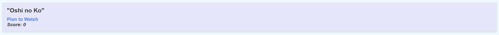

# MyAnimeList XML Styling

This is a program that applies an XSLT stylesheet (based on the MyAnimeList UI) to an XML file exported from MyAnimeList.net to generate an HTML file with customized styling. The provided XSLT stylesheet will format the anime list data and apply specific CSS styles to the HTML output.

## Coloring Feature

This program has been enhanced with a colouring feature that helps you visually distinguish different anime entry statuses as follows:







## Usage

1. [Export your MyAnimeList](http://myanimelist.net/panel.php?go=export) from MyAnimeList.net as an XML file. Save it as `myanimelist.xml` in the same directory as the Python script.

2. Run the Python script `main.py`:

    ```powershell
    python main.py
    ```

The script will read the `myanimelist.xml` and `myanimelist.xslt` files, apply the XSLT transformation, insert `app.js` for styling, and save the result as `styled_myanimelist.html` in the same directory.

Open `styled_myanimelist.html` in your web browser to view your styled anime list.

## How it Works

The Python script uses the lxml.etree library to parse the XML and XSLT files. It applies the XSLT transformation to the XML data, resulting in an HTML output with the specified styling from the XSLT stylesheet.

The XSLT stylesheet (`myanimelist.xslt`) includes a modern, minimalistic MyAnimeList-based theme. It formats the user information and each anime entry using specific HTML elements and CSS classes. The CSS styles are defined within the XSLT stylesheet to apply the desired appearance to the HTML output.

_Note: Make sure you have the 'lxml' library installed before running the Python script. If you don't have it installed, you can install it using pip:_

```bash
pip install lxml
```

Enjoy styling and organizing your anime list!

## License

Copyright (C) 2023 KazutoKiritoKirigaya <https://github.com/KazutoKiritoKirigaya>

This project is licensed under the AGPL-3.0 License - see the [LICENSE](https://github.com/KazutoKiritoKirigaya/styling-myanimelist-exports/blob/master/LICENSE) file for details.
